# Procesverslag
Markdown is een simpele manier om HTML te schrijven.  
Markdown cheat cheet: [Hulp bij het schrijven van Markdown](https://github.com/adam-p/markdown-here/wiki/Markdown-Cheatsheet).

Nb. De standaardstructuur en de spartaanse opmaak van de README.md zijn helemaal prima. Het gaat om de inhoud van je procesverslag. Besteedt de tijd voor pracht en praal aan je website.

Nb. Door *open* toe te voegen aan een *details* element kun je deze standaard open zetten. Fijn om dat steeds voor de relevante stuk(ken) te doen.

## Jij

  
uitwerken voor kick-off werkgroep

  ### Auteur:
  Jeffrey Netten

  #### Je startniveau:
  Blauw

  #### Je focus:
  Responsive
 

## Je website

  
uitwerken voor kick-off werkgroep

  ### Je opdracht:
  https://www.snickers.nl/
  
  #### Screenshot(s) van de eerste pagina (small screen): 
  Hoofdpagina  
  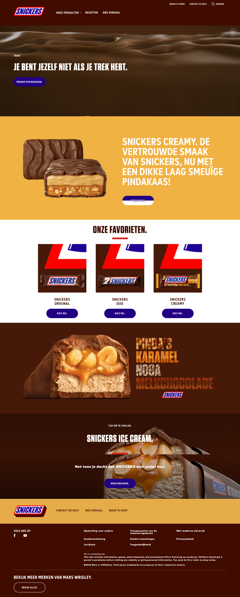

  #### Screenshot(s) van de tweede pagina (small screen):
  Productpagina  
  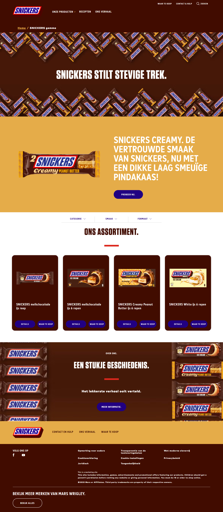
 

## Toegankelijkheidstest 1/2 (week 1)

  
uitwerken na test in 2e werkgroep

  ### Bevindingen
  De test heb ik hieronder gedaan met mijn vriendin aangezien ik niet in de les aanwezig was. De voornamelijkste bevindeningen zijn hoeveel divs en spans er op de website worden gebruikt.
  Ook voor elementen met eigenlijk hele duidelijke benamingen.
  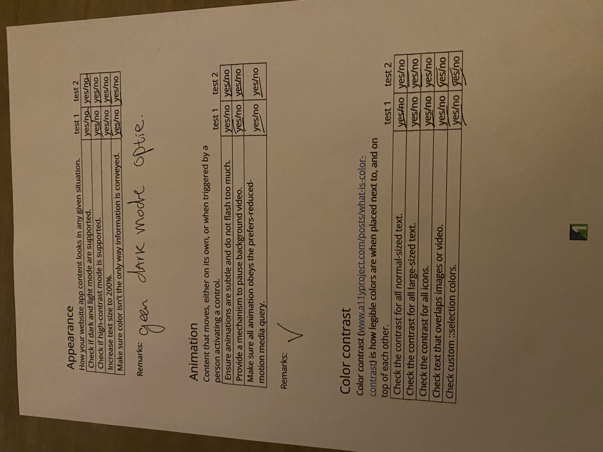
  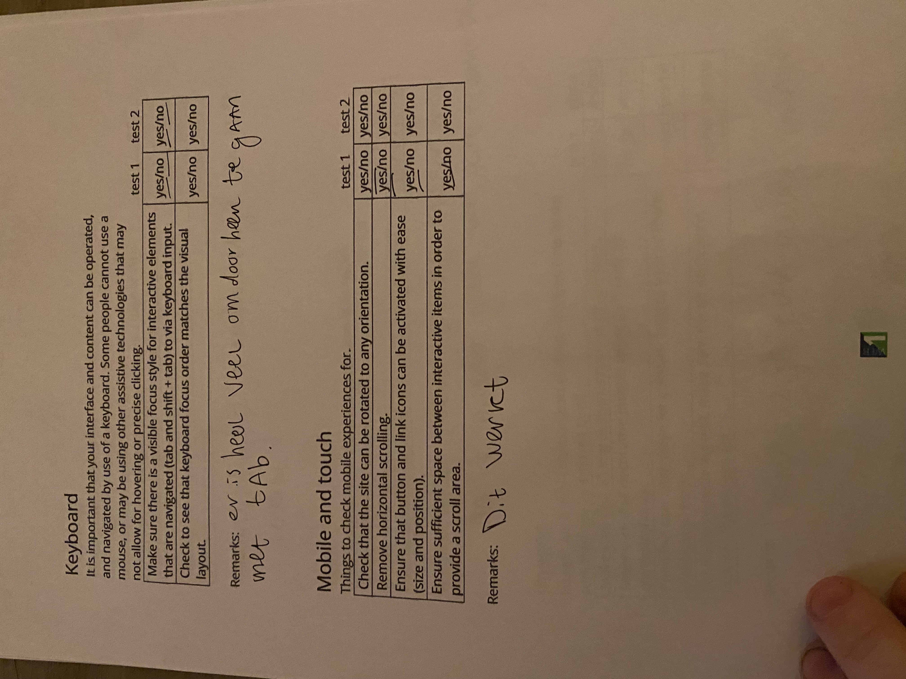
  
  
  

## Breakdownschets (week 1)

  
uitwerken na afloop 3e werkgroep

  ### de hele pagina: 
  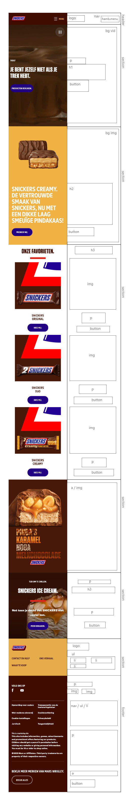

  ### de tweede pagina: 
  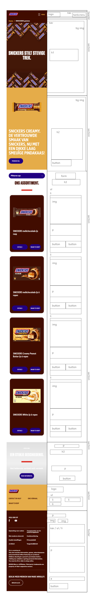

## Voortgang 1 (week 2)

  
uitwerken voor 1e voortgang

  ### Stand van zaken
  Ik had nog geen HTML dus heb vooral de feedback van andere overgenomen.
  Hieronder is de lijst te vinden van de bevindingen die ik handig vond tijdens dit feedback gesprek.

  ### Verslag van meeting
  hier na afloop snel de uitkomsten van de meeting vastleggen

  -Javascript altijd onderaan de pagina linken
  -Geen hoofdletters gebruiken als het hele teksten zijn. Gebruik CSS om dit op te maken.
  texttransform = uppercase
  -check je favicon heb je die?
  -header title moet je website en pagina naam hebben.
  -3 stylesheets in totaal, voor beide pagina's en een basis sheet.
  -1 niveau menu is maar nodig *hamburger menu niet in detail.
  -Button is een actie, 
  in de nav gebruik je over het algemeen A 
  -logo moet in A
  -CSS background image (decoratie) HTML image is voor informatie.
  -Begin de opdracht met telefoon size scherm.
  -CSS verstoppen mag met class. (How to hide content = a11y site)

## Voortgang 2 (week 3)

  
uitwerken voor 2e voortgang

  ### Stand van zaken
  Ik heb nu de basis van mijn HTML uitgewerkt en een begin gemaakt aan de CSS.
  Ik ga vooral vragen of mijn html nu correct is zodat ik volledig kan gaan focusen op mijn CSS.
  

  ### Verslag van meeting
  hier na afloop snel de uitkomsten van de meeting vastleggen

  De html zou nu moeten kloppen qua opstelling.
  Ik moet alleen nog gaan kijken naar de extension simplify/beautify omdat de spacing niet op 
  alle plaatsen correct is.

  Ik heb meegekeken bij de andere die feedback kregen en snap nu hoe je je eigen font in het 
  bestand kan plaatsen. Dat is daarbij ook het eerste wat ik ga doen.

## Toegankelijkheidstest 2/2 (week 4)

  
uitwerken na test in 9e werkgroep

  ### Bevindingen
  Lijst met je bevindingen die in de test naar voren kwamen (geef ook aan wat er verbeterd is):

  Ik heb deze test zelf gedaan en heb hierbij mijn eigen site getest.
  
  
  
  
  

## Voortgang 3 (week 4)

  
uitwerken voor 3e voortgang

  ### Stand van zaken
  De afgelopen dagen ben ik veel opgeschoten met mijn opdracht.
  Zo ben ik begonnen en heb ik een hele sprint met mijn html gedaan.
  Ik heb een start gemaakt aan de hamburger menu.

  ### Agenda voor meeting
  Vragen voor de meeting:
  - Vraag over: Footer heeft op 1 of andere manier mijn animatie van me header voor een klein stukje
  - alignment klopt niet op alle plekken en krijg het niet correct
  - animatie button zijwaards maken
  - hamburger menu linken
  - font een probleem?
  - video op de achtergrond
  - image op de achtergrond

    Wat ik nog moet doen voordat ik een eindproduct heb:
    - Javascript
    - Light/dark mode
    - hamburger linken
    - css afmaken
    - responsive maken
    - Video op de achtergrond krijgen
    - Animaties toevoegen bij hover
    - Footer afmaken

  ### Verslag van meeting
  hier na afloop snel de uitkomsten van de meeting vastleggen

  - Button animatie uitleg
  - Video op achtergrond af laten spelen uitleg

## Eindgesprek (week 5)

  
uitwerken voor eindgesprek

  ### Je uitkomst - karakteristiek screenshots:
  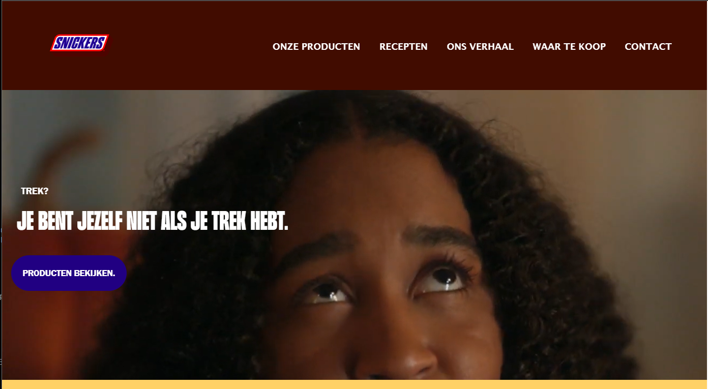
  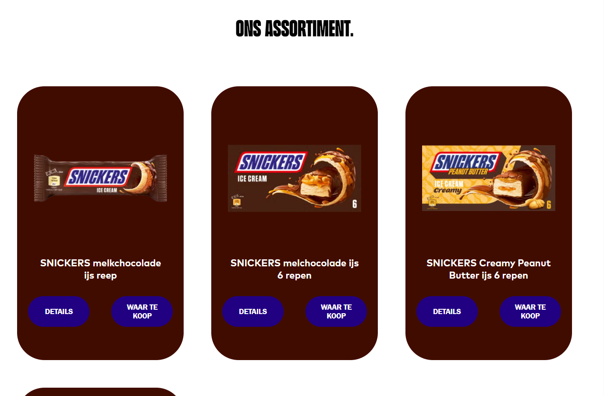
  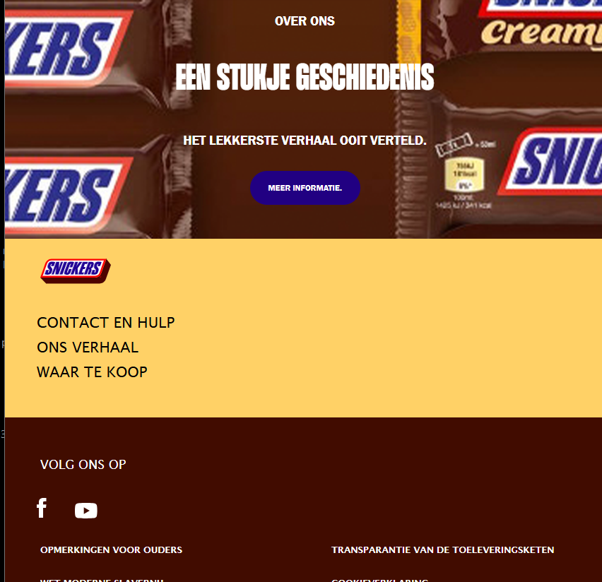
  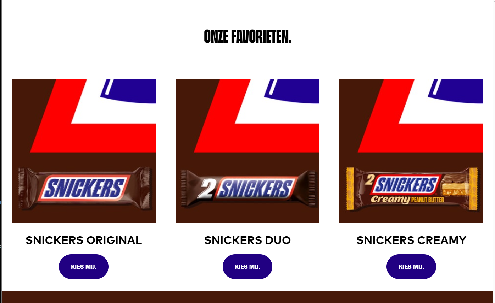
  
  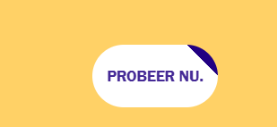
  
  

  ### Dit ging goed/Heb ik geleerd: 
  Voordat ik dit jaar aan dit vak begon zat ik er helemaal doorheen.
  Dit is al de zoveelste keer dat ik dit vak ging proberen. Een vak waar ik altijd zoveel moeite mee had.
  Maar dit jaar is dat helemaal veranderd. Door met volledige focus hard te werken hieraan ben ik eindelijk blij en trots op mijn eindproduct.

  Wat naar mijn mening goed is gegaan is dat mijn volledige website nu responsive is:
  
  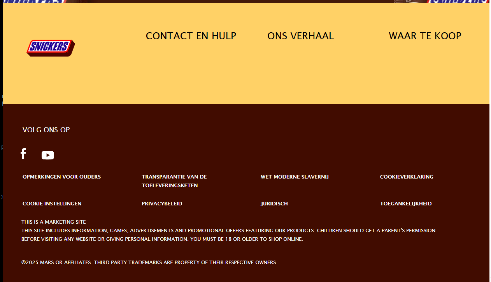
  Dit is iets dat ik aan het begin van dit vak zeker nog niet eens aan durfde te beginnen.

  Waar ik ook trots op ben is hoe de grids werken op verschillende beeldgrotes:
  
  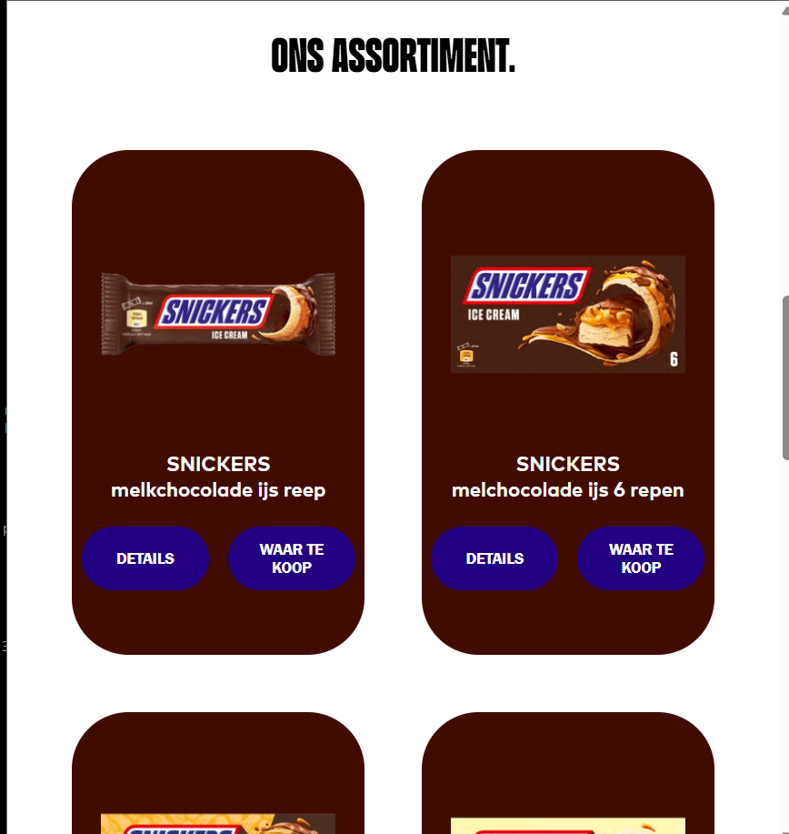

  Daarnaast ben ik heel blij met de animaties bij de hovers op de buttons en navigatie
  
  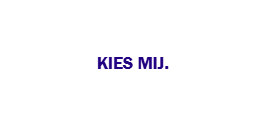

  Ook ben ik blij met de customproperties die ik heb toegevoegd met dan onder andere de nightmode die de snickers website zelf niet had.
  

  Al met al ben ik heel trots dat ik het gevoel heb dat ik dit eindelijk kan. Iets waarvan ik begin dit blok nog geen idee had hoe ik echt moest beginnen om een tof eindproduct te krijgen is nu iets geworden waar ik met plezier aan heb zitten werken.

  ### Dit was lastig/Is niet gelukt:
  Korte omschrijving met plaatjes
  het is mij helaas nog niet gelukt om de pauze en start knop toe te voegen aan de video. Misschien is me dat wel gelukt voordat ik bij het eindgesprek binnen kom lopen.

  
  
  Ook heb ik nog wel moeite met de screenreader elementen en hoe dat precies werkt. Ik begin bijna te denken dat het aan mijn laptop ligt.
  

## Bronnenlijst

  
continu bijhouden terwijl je werkt

  Nb. Wees specifiek ('css-tricks' als bron is bijv. niet specifiek genoeg). 
  Nb. ChatGpT en andere AI horen er ook bij.
  Nb. Vermeld de bronnen ook in je code.

  1. Button design tijdens de les
  2. https://www.youtube.com/watch?v=3K6zr1CdZy8&list=PL4-IK0AVhVjNDRHoXGort7sDWcna8cGPA&index=3 (Bijleren van de basis)
  3. https://www.youtube.com/watch?v=4wo4csHfabw (folder github)
  4. https://www.youtube.com/watch?v=_oFWg_NlKdo (css background image/gif)
  5. https://www.youtube.com/watch?v=dMxOojFq2ho&t=69s (nth of type)
  6. https://www.youtube.com/watch?v=Nef3xAYhquE (Bijleren van de basis)
  7. https://www.youtube.com/watch?v=AAU25Fo4bFY (Custom fonts)
  8. https://www.youtube.com/watch?v=-unASUgYtVI (Video op de achtergrond afspelen)
  9. https://www.youtube.com/watch?v=_ir9du6fq4Q (navigatie tussen pagina's vanuit html)
  10. https://www.youtube.com/watch?v=3T0gjtXRNC0 (grids in css responsive maken)
  11. https://www.w3schools.com/css/css_grid.asp (grid layout guide)
  12. https://www.youtube.com/watch?v=XGKj4HtIcGo (custom properties)
  13. https://stackoverflow.com/questions/27853884/media-queries-and-image-swapping (image swapping)
  14. https://www.youtube.com/watch?v=n9yI6fjkrfE (media queries)
  15. https://www.w3schools.com/css/css_border_sides.asp (border-sides)
  16. https://www.youtube.com/watch?v=aNDqzlAKmZc (hamburger menu)
  17. https://dequeuniversity.com/screenreaders/nvda-keyboard-shortcuts#nvda-nvda_shortcut_keys (screen reader)

